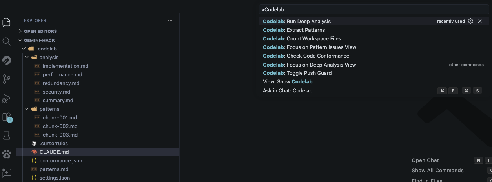

# Codelab

**AI-powered code pattern extraction, conformance checking, and deep analysis for VS Code.**

Codelab analyzes your codebase to extract engineering patterns, then enforces them — catching style violations, implementation issues, and deeper problems before they reach production. It uses [Claude Code CLI](https://docs.anthropic.com/en/docs/claude-code/overview) as its AI backbone.

Built for teams who care about code quality but don't want to write 500 ESLint rules by hand.



---

## Why Codelab?

Every codebase has patterns — naming conventions, error handling styles, import ordering, architectural decisions. New team members break them. AI coding assistants ignore them. Linters only catch what you explicitly configure.

Codelab solves this by:

1. **Extracting** your existing patterns automatically from the code itself
2. **Checking** every file against those patterns
3. **Showing** violations inline with squiggly lines, hover cards, and quick-fix suggestions
4. **Blocking** sloppy code from being pushed via a git pre-push hook
5. **Finding** deeper issues like redundancy, race conditions, performance bottlenecks, and security concerns

No manual rule writing. No YAML configuration. Just point it at your code and go.

---

## Prerequisites

### Claude Code CLI (Required)

Codelab requires Claude Code CLI to be installed and authenticated. Without it, the extension cannot function.

**Install Claude Code:**

```bash
npm install -g @anthropic-ai/claude-code
```

Then authenticate:

```bash
claude
```

Follow the prompts to sign in with your Anthropic account.

> If Claude Code CLI is not detected, Codelab will show an error with a link to the install guide.

### Subscription Requirements

| Feature | Minimum Plan |
|---------|-------------|
| Pattern Extraction | Any Claude plan |
| Conformance Checking | Any Claude plan |
| Push Guard | No API calls (local) |
| **Deep Analysis** | **Pro or higher** (uses Opus model) |

Deep Analysis uses the Opus model for orchestration, which requires a Claude Pro subscription or higher. A cost warning is shown before running.

---

## Getting Started

### 1. Install the Extension

Install Codelab from the VS Code Marketplace, then reload your window.

### 2. Extract Patterns

Open the Command Palette (`Cmd+Shift+P` / `Ctrl+Shift+P`) and run:

```
Codelab: Extract Patterns
```

This analyzes your codebase and generates:
- `.codelab/patterns.md` — your codebase's engineering patterns
- `.codelab/CLAUDE.md` — rules for Claude Code to follow
- `.codelab/.cursorrules` — rules for Cursor AI to follow

For large codebases (50+ files), Codelab automatically deploys parallel sub-agents to analyze chunks concurrently, then compiles the results into a unified document.

### 3. Check Conformance

Run:

```
Codelab: Check Code Conformance
```

This checks every file against your extracted patterns and reports violations as:
- Inline squiggly lines (errors and warnings)
- Hover cards with the rule and suggested fix
- Quick-fix lightbulb actions
- A sidebar tree view grouped by file

### 4. Fix Issues

As you fix violations and save files, Codelab automatically removes resolved issues in real-time — no need to re-run the full check.

### 5. Enable Push Guard (Optional)

Run `Codelab: Toggle Push Guard` to install a git pre-push hook. When enabled, `git push` will be blocked if there are conformance errors (warnings are allowed through).

### 6. Run Deep Analysis (Optional)

Run `Codelab: Run Deep Analysis` for a thorough review that finds:
- **Redundancy** — duplicate logic, copy-pasted code
- **Implementation issues** — race conditions, incorrect async patterns, resource leaks
- **Performance** — N+1 queries, blocking operations, expensive hot paths
- **Security** — injection risks, hardcoded secrets, insecure defaults

Results appear in the **Deep Analysis** panel in the Codelab sidebar, grouped by severity (critical / warning / info).

---

## Features

### Pattern Extraction
Automatically discovers your codebase's naming conventions, import styles, error handling patterns, formatting, type usage, and more. Outputs a structured `patterns.md` document.

### Conformance Checking
Checks all files against extracted patterns. Reports issues with file, line, severity, and a specific suggestion for how to fix each one.

### Real-Time Updates
When you save a file, Codelab checks if flagged lines have changed and removes resolved issues instantly — without calling Claude again.

### Persistence
Conformance results survive window reloads. Issues are cached in `.codelab/conformance.json` with SHA-256 hash validation. If files or patterns change, stale issues are automatically discarded.

### Git Push Guard
A pre-push hook that reads the cached conformance data and blocks `git push` if errors exist. No API calls at push time — it's instant.

### Large Codebase Scaling
For codebases with 50+ files, Codelab chunks files by directory and spawns parallel Haiku sub-agents. A Sonnet compiler then merges the results. Chunk files are saved to `.codelab/patterns/` for audit.

### Deep Analysis
An Opus-orchestrated, multi-agent analysis that runs 4 specialized Sonnet agents in parallel (redundancy, implementation, performance, security). Results are compiled and shown in a dedicated tree view.

### Cancellable Operations
All long-running operations (pattern extraction, conformance checking, deep analysis) can be cancelled from the progress notification.

---

## Commands

| Command | Description |
|---------|-------------|
| `Codelab: Extract Patterns` | Analyze codebase and generate patterns.md |
| `Codelab: Check Code Conformance` | Check all files against patterns |
| `Codelab: Run Deep Analysis` | Run Opus-orchestrated deep analysis |
| `Codelab: Toggle Push Guard` | Enable/disable git pre-push hook |
| `Codelab: Count Workspace Files` | Count analyzable files |

---

## Generated Files

All generated files live in the `.codelab/` directory:

```
.codelab/
  patterns.md          — extracted engineering patterns
  CLAUDE.md            — rules for Claude Code
  .cursorrules         — rules for Cursor AI
  conformance.json     — cached conformance issues
  settings.json        — extension settings
  patterns/            — sub-agent chunk outputs (large codebases)
    chunk-001.md
    chunk-002.md
    ...
  analysis/            — deep analysis outputs
    redundancy.md
    implementation.md
    performance.md
    security.md
    summary.md
```

You can choose to `.gitignore` the `.codelab/` directory or commit it so your team shares the same patterns.

---

## Troubleshooting

**"Claude Code CLI not found"**
Install it with `npm install -g @anthropic-ai/claude-code` and make sure `claude` is in your PATH.

**"No patterns found"**
Run `Codelab: Extract Patterns` before checking conformance.

**Deep Analysis button is grayed out or fails**
Deep Analysis requires a Claude Pro or higher subscription for Opus model access.

**Conformance results disappeared after reload**
If you modified files or re-extracted patterns, cached issues are invalidated. Run conformance check again.

---

## Release Notes

### 0.0.1

Initial release:
- Pattern extraction with auto-scaling (single session or parallel sub-agents)
- Conformance checking with inline diagnostics, hover cards, and code actions
- Real-time issue resolution on file save
- Persistent conformance cache with hash validation
- Git pre-push guard (toggle on/off)
- Deep Analysis engine (Opus + Sonnet multi-agent)
- Deep Analysis tree view grouped by severity
- Cancellable operations
- Claude Code CLI detection

---

## Author

**Brian Mwangi** — [brianmwangi.dev](https://brianmwangi.dev)

---

## License

MIT
